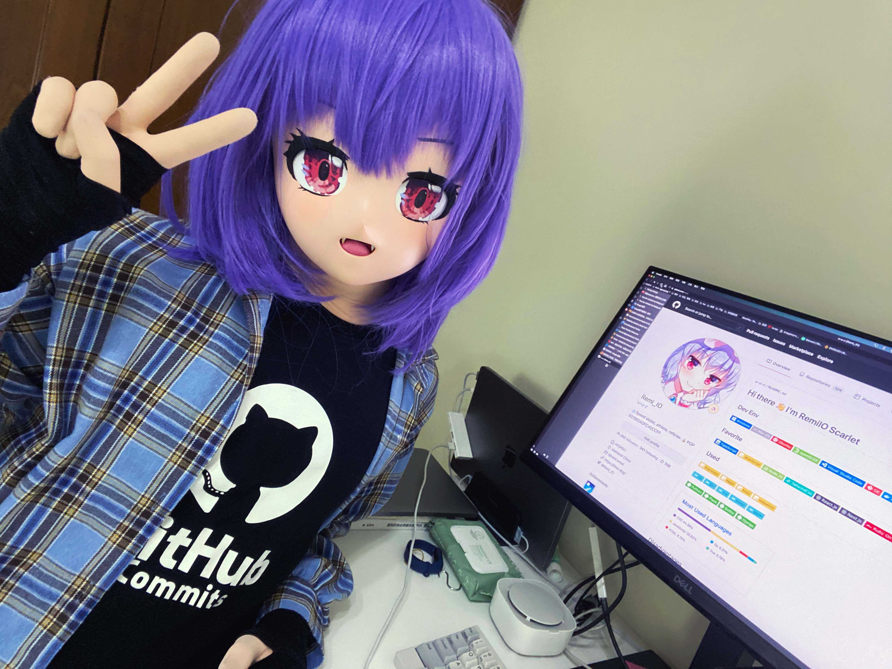

# 👋 Hi there I'm Remi. 🦇


---
  
```
🆔 ID: Remi | RemiIO | Remi_IO | Remi10
```


## 💼 WORKING ON
- [Hackplan](https://github.com/HackPlan) (2018.05-2021.09)
- [Meta.io](https://github.com/Meta-Network) (2021.09-2022.03)
- Working for a mysterious DeFi/Web3  organization. (2022.03-today)

## 💪 SKILL DESCRIPTIONS

- Web App development using **React**, **TypeScript**, **Next.js**, **Node.js**, **Go**, **Python**, **Ruby**, **PHP**.
- Use Unix-like environment, use macOSX + Docker, Git, Zsh, VSCode, Iterm2 and other tools to complete daily development work, have Ubuntu, Debian, OpenSUSE and other Linux environment development, operation and maintenance experience, maintain infrastructure and CI and other automated services.
- Use **MySQL (MariaDB)**, **PostgreSQL**, **Redis**, and have worked with **MongoDB**, **CouchDB**, and **influxdb (TSDB)** databases.
- Developed **Ethereum**, **Substrate** blockchain smart contracts using **Solidity**, developed Dapp (Web3 application interacting with blockchain network) using **Ethers.js**, **Polkadot.js**, **OpenZeppelin**, **Hardhat**, **Ganache**, **Remix IDE**, DeFi Business experience.
- UI/UX design using **Figma**, complete vector graphics design.
- Develop WeChat applets using **Taro.js** and experience in WeChat public platform development.
- **RESTful / GraphQL** API development using Strapi, Keystone.js Headless CMS.
- Experience in full-stack development, capable of UI/UX design, data model design, front-end and back-end business logic and functional implementation
Continuously follow up on cutting-edge technologies in the field and willing to share.

## 👶 AVATARS (Animation/Kigurumi)
   

## 🔧 ENVIRONMENT
OS:


  

IDE & Tools:


## 🍎 FAVORITE


  


  


## 🧾 USED


  
![[Python] Python](https://img.shields.io/badge/-Python-339900?style=flat-square&logo=Python&logoColor=white)
![[Python] Flask](https://img.shields.io/badge/-Flask-339900?style=flat-square&logo=Python&logoColor=white)
![[Python] Bottle](https://img.shields.io/badge/-Bottle-339900?style=flat-square&logo=Python&logoColor=white)
![[Python] Django](https://img.shields.io/badge/-Django-339900?style=flat-square&logo=Python&logoColor=white)

[](https://github.com/anuraghazra/github-readme-stats)

## 🌱 DISADVATAGES
- I have not undergone systematic algorithm training, I need learn it;

## 📈 STATS
![GitHub Readme Stats][ReadmeStats-Image]

[ReadmeStats-Image]: https://github-readme-stats.vercel.app/api?username=u-u-z&show_icons=true&bg_color=ffffff "GitHub Readme Stats"


